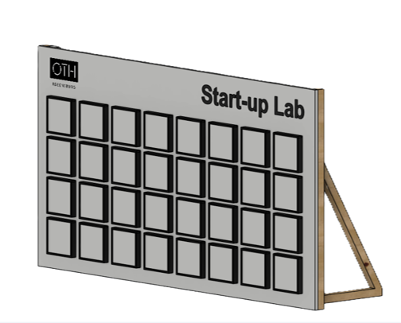

# cWall (Interactive Coordination Wall)

cWall is an interactive, reaction-based coordination wall designed as a student project for **PMT2 (Praktikum Messtechnik 2)** during the Summer Semester 2026. 

---

## Game Concept & Play Principle
The cWall is a speed and reaction game where players must trigger randomly illuminated targets as quickly as possible within a 60-second time window.

* **Sequential Progression:** Only one box lights up at a time. The moment it is successfully pressed, the next random target activates instantly.
* **Singleplayer Mode:** The player uses the entire 32-box grid to rack up the highest score possible.
* **Multiplayer Duel Mode:** The playing field is divided into two separate, independent halves (16 boxes each) for head-to-head competition.
* **Integrated Highscores:** The system automatically tracks and saves the top 10 scores persistently.

---

## Key Features
* **ESP32-S3 Control Center:** Runs a FreeRTOS-based firmware.
* **Wireless Web Dashboard:** The ESP32-S3 acts as a Wi-Fi Access Point (SSID: `C-Wall`). By connecting to the network and navigating to `192.168.1.1`, players can view live scores, a countdown timer, game status, and the highscore board in real time. Also the game settings can be adjusted via the web interface and all the logging can be accessed for debugging and performance analysis.
* **Real-time WebSockets:** Utilizes non-blocking WebSocket communication for immediate, bi-directional data transfer between the microcontroller and web browsers.
* **Modular Sensor Boxes:** 32 individual 20x20 cm 3D-printed modular sensor boxes containing internal WS2812b NeoPixel LED strips and TTP223 capacitive touch sensors.
* **Capacitive Touch Detection:** Reliable touch response through a copper-mesh grid embedded into the acrylic faceplates, connected to low-cost, self-contained TTP223 touch chips.
* **Dedicated I/O Expansion:** Employs MCP23018 I/O expanders connected via I²C to handle the high number of digital sensor inputs while conserving ESP32 pins.
* **Robust Power Delivery:** Powered by a 300W (5V/60A) switching power supply, distributed via a star topology to prevent voltage drops when LEDs display full white.
* **Custom PCB Design:** Two-sided component PCB designed using KiCad and manufactured specifically to host the level shifters, I/O expanders, and connector terminals.
* **3D-Printed Enclosures:** All sensor boxes and the main control unit are housed in custom-designed 3D-printed enclosures for durability and aesthetics.
